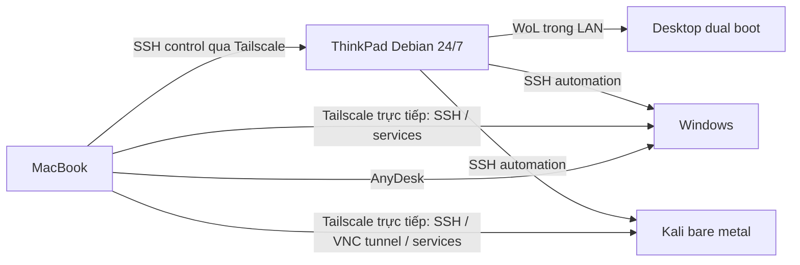

# Kiến trúc v2

Windows và Kali là hai OS trên cùng một desktop, chỉ một OS chạy tại một thời điểm.
ThinkPad sở hữu logic điều phối. Mac dùng wrapper gọi CLI trên ThinkPad; các phiên
interactive kết nối trực tiếp tới node Tailscale của OS đang chạy, không cần ProxyJump.
Windows và Kali có identity Tailscale riêng. ThinkPad tiếp tục dùng LAN cho automation;
các IP/name Tailscale tương tác của Mac không thay WINDOWS_HOST/KALI_HOST controller.

WoL chỉ cấp lệnh bật máy. BootNext/bootsequence chọn OS cho một lần boot.
Tailscale cung cấp reachability; SSH cung cấp authentication và control/access.

## State machine

`status` xác minh cả hai endpoint bằng key và marker OS. Kali helper kiểm tra
`/etc/os-release`; Windows dùng PowerShell kiểm tra platform. Nếu cả hai trả lời,
config không mô tả đúng một desktop: trả UNKNOWN.

TRANSITIONING là ý định điều phối có deadline được lưu atomically trong state dir.
Live OS có ưu tiên cao hơn cache. Mất SSH trong một reboot do pwnbox khởi tạo được
coi là transition; hết hạn trở thành UNKNOWN. Reboot thủ công không có cached intent
có thể hiện UNKNOWN. Không dùng cached WINDOWS/KALI thay cho kiểm tra live.

OFF được suy luận sau shutdown có acknowledgment, gateway LAN còn trả lời và desktop
không phản hồi ping/TCP qua nhiều mẫu. Cache chỉ sống `OFF_CACHE_TTL`; bất kỳ dấu hiệu
sống nào hoặc LAN lỗi làm kết quả UNKNOWN. Không có cảm biến nguồn nên OFF không phải
bằng chứng vật lý. Lần khởi động controller đầu tiên khi desktop tắt có thể là UNKNOWN.
`wake/windows/kali` vẫn có thể gửi WoL từ trạng thái đó; phải nhận diện OS trước reboot.

## Reliability

- `flock` khóa các command thay đổi trạng thái, còn status đọc state atomically.
- Chỉ retry WoL trong giới hạn; không retry lệnh reboot/shutdown mù.
- Mỗi SSH có connect timeout và outer GNU timeout; TCP và ping cũng bị giới hạn.
- Các vòng chờ dùng thời gian thực; deadline có thể vượt tối đa một vòng probe/poll.
- SSH exit 255/timeout sau action được xem là không chắc chắn: chờ OS đích.
- Shutdown mất acknowledgment trả UNKNOWN dù desktop không còn trả lời.
- Log ra stderr, status một dòng ra stdout; diagnostic SSH trong state dir.

CLI chạy bằng user Debian, không chạy toàn bộ controller bằng root. Key Windows hiện
dùng account administrator để bcdedit chạy được; quyền này rộng hơn endpoint Kali.
Không dùng agent forwarding. Restrict key Windows hơn nữa là cải tiến riêng sau LAN test.
